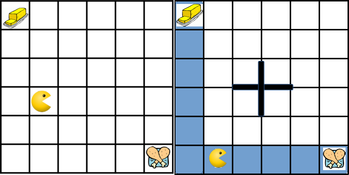
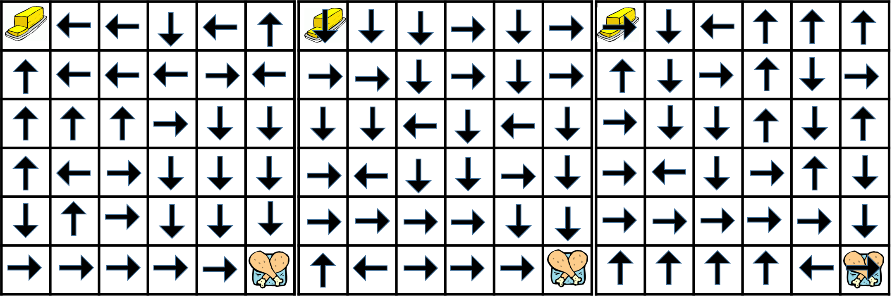

# Reward Search and Reward Shaping in Reinforcement Learning

The PDF report for the project is available on [this link](https://ishank-juneja.github.io/assets/docs/reward-shaping-report.pdf).

Some of the environments and policies considered in this paper-

   
  

   
  

### Instructions to run the scripts

The code is available in the `source` folder.

Instructions Coming soon ... 

### References:

[1] Ng, A. Y., Harada, D., and Russell, S. J.  
Policy invariance under reward transformations: Theory and application to reward shaping.   
In Proceedings of the Sixteenth International Conference on Machine Learning, ICML’99  
Morgan Kaufmann Publishers Inc., 1999.

[2] Singh, S., Lewis, R. L., and Barto, A. G.  
Where do rewards come from?  
In Proceedings of the Annual Conference of the Cognitive Science Society, 2009.

[3] Singh, S. P., Lewis, R. L., Barto, A. G., and Sorg, J.  
Intrinsically motivated reinforcement learning: An evolutionary perspective.  
IEEE Trans. Autonomous Mental Development.